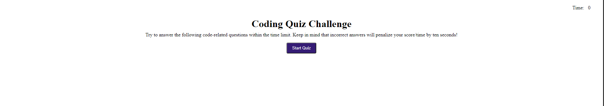

#JS-Quiz
This is a basic from to build a quiz on. Change the questions and answers to what you need and you have a working quiz that will keeps track of your score.

Correct answers increase your score while incorrect answers will cost the user time.

https://hp-adam.github.io/js-quiz/

